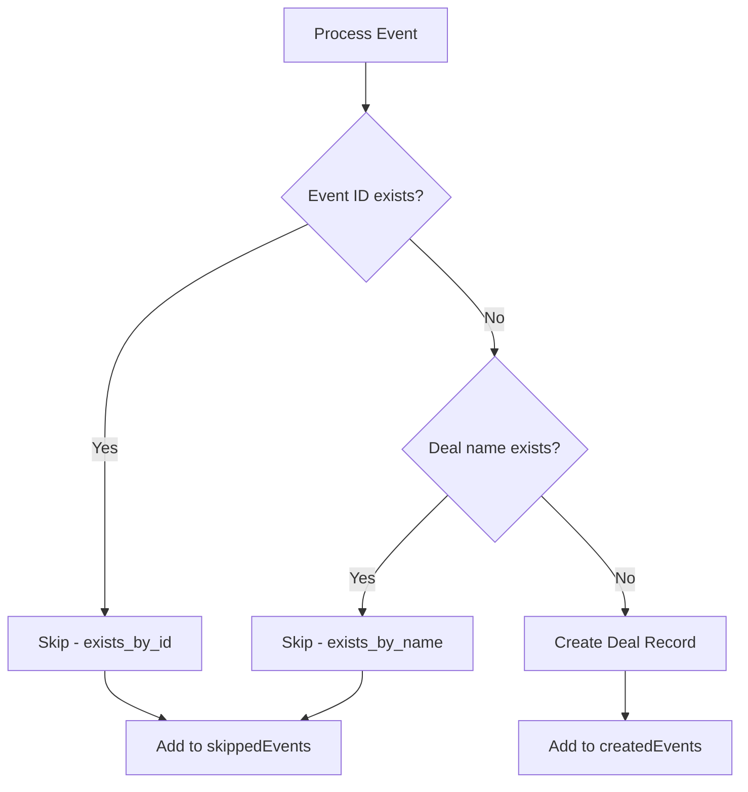

The script implements a dual-check system to prevent duplicate deal records from being created in HubSpot.

## Why Duplicate Prevention Matters

<Warning>
HubSpot enforces uniqueness constraints on certain properties. Attempting to create a duplicate record will result in a `VALIDATION_ERROR` that stops the sync process.
</Warning>

The script prevents duplicates by checking:

1. **Event ID**: Whether a deal already exists with the same `evento_marketing_id`
2. **Deal Name**: Whether a deal already exists with the same `dealname`

## Checking by Event ID

The `eventExists` function searches for existing deals using the marketing event's unique ID.

```javascript events.js
const eventExists = async (eventId) => {
  const res = await fetch(`${CUSTOM_OBJECT_API}/search`, {
    method: "POST",
    headers: {
      Authorization: `Bearer ${accessToken}`,
      "Content-Type": "application/json",
    },
    body: JSON.stringify({
      filterGroups: [
        {
          filters: [
            {
              propertyName: "evento_marketing_id",
              operator: "EQ",
              value: eventId,
            },
          ],
        },
      ],
      properties: ["evento_marketing_id"],
    }),
  });

  const data = await res.json();
  return data.total > 0;
};
```

### How It Works

- Uses HubSpot's **CRM Search API** to find deals
- Filters by the custom property `evento_marketing_id`
- Returns `true` if any records are found (`total > 0`)
- Returns `false` if no matching records exist

<Info>
This check ensures that the same marketing event isn't synced multiple times, even if the script runs repeatedly.
</Info>

## Checking by Deal Name

The `recordExistsByName` function prevents duplicate deal names, which is a common HubSpot uniqueness constraint.

```javascript events.js
const recordExistsByName = async (name) => {
  if (!name) return false;
  const res = await fetch(`${CUSTOM_OBJECT_API}/search`, {
    method: "POST",
    headers: {
      Authorization: `Bearer ${accessToken}`,
      "Content-Type": "application/json",
    },
    body: JSON.stringify({
      filterGroups: [
        {
          filters: [
            {
              propertyName: "dealname",
              operator: "EQ",
              value: name,
            },
          ],
        },
      ],
      properties: ["dealname"],
    }),
  });

  const data = await res.json();
  return data.total > 0;
};
```

### Key Features

- **Null safety**: Returns `false` immediately if name is empty
- **Exact matching**: Uses `EQ` operator for precise name comparison
- **Early validation**: Prevents API errors before attempting to create the deal

## Integration in Main Loop

Both checks are performed sequentially in the main processing loop before creating any records.

```javascript events.js
for (const e of todayEvents) {
  try {
    const alreadyExistsById = await eventExists(e.id);
    if (alreadyExistsById) {
      skippedEvents.push({ name: e.eventName, reason: "exists_by_id" });
      console.log(`⏭️  Evento ya existe por ID: ${e.eventName}`);
      continue;
    }

    // Evitar crear si ya existe un registro con el mismo nombre (previene VALIDATION_ERROR)
    const nameExists = await recordExistsByName(e.eventName);
    if (nameExists) {
      skippedEvents.push({ name: e.eventName, reason: "exists_by_name" });
      console.log(`⏭️  Evento ya existe por nombre: ${e.eventName}`);
      continue;
    }

    const created = await createCustomRecord(e);
    createdEvents.push(created);
    console.log(`✅ Evento creado: ${created.dealname}`);
  } catch (eventErr) {
    failedEvents.push({
      name: e.eventName,
      error: eventErr.message,
    });
    console.error(
      `❌ Error creando evento "${e.eventName}":`,
      eventErr.message
    );
  }
}
```

## Workflow Diagram



## Skip Reasons

The script tracks why events are skipped with specific reason codes:

<CardGroup cols={2}>
  <Card title="exists_by_id" icon="fingerprint">
    A deal with the same `evento_marketing_id` already exists
  </Card>
  <Card title="exists_by_name" icon="tag">
    A deal with the same `dealname` already exists
  </Card>
</CardGroup>

## Example Skipped Events Output

```json
{
  "skippedEvents": [
    {
      "name": "Annual Conference 2024",
      "reason": "exists_by_id"
    },
    {
      "name": "Product Launch Webinar",
      "reason": "exists_by_name"
    }
  ]
}
```

## Performance Considerations

<Note>
Each duplicate check requires an API call to HubSpot's search endpoint. For large batches of events, this can add latency. However, this is necessary to prevent validation errors.
</Note>

### Optimization Strategies

1. **Sequential checks**: ID check runs first since it's the primary identifier
2. **Early exit**: `continue` immediately when duplicate is found
3. **Minimal properties**: Only requests the specific property needed for validation

## Error Prevention

Without duplicate prevention:

```json
// ❌ HubSpot API Error
{
  "status": "error",
  "message": "VALIDATION_ERROR",
  "errors": [
    {
      "message": "Property values were not unique: [dealname]"
    }
  ]
}
```

With duplicate prevention:

```javascript
// ✅ Graceful skip
skippedEvents.push({ name: e.eventName, reason: "exists_by_name" });
console.log(`⏭️  Evento ya existe por nombre: ${e.eventName}`);
```
